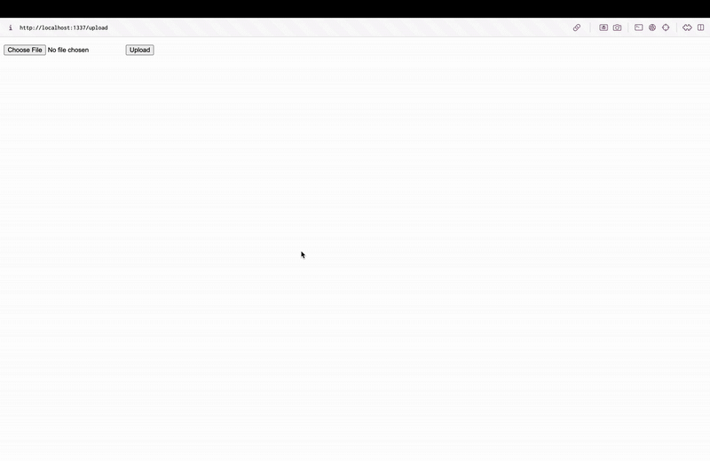

# Flask on Docker with Postgres, Gunicorn, and Nginx  

## 📌 Overview  
This repository sets up a **Flask web service** running inside Docker, backed by **Postgres**, with **Gunicorn** handling WSGI requests and **Nginx** as a reverse proxy. It also supports **static and media file uploads**, making it a production-ready web app setup.

The project follows a **step-by-step containerization process**:
- **Flask** for the backend
- **Docker & Docker Compose** for container orchestration
- **PostgreSQL** as the database
- **Gunicorn** as the WSGI server
- **Nginx** as the reverse proxy for performance and security
- **Static & media file handling** through Nginx

### 🎥 Demo GIF – Uploading an Image  
  


## 🛠️ Build & Run Instructions  

### 🚀 Quick Start (Development)  
Ensure **Docker & Docker Compose** are installed before running these commands.  

**Clone the repository:**  
```
git clone https://github.com/your-username/flask-on-docker.git
cd flask-on-docker
```

***Set up environment variables:***
* Copy `.env.dev.example` to `.env.dev`
* Edit the file to match your system

***Start the containers:***
```
docker-compose up -d --build
```

***Verify the service***
* Open http://localhost:5001/ – Should return ```Open http://localhost:5001/ – Should return```
* Upload an image via http://localhost:5001/upload
* View the uploaded image at http://localhost:5001/media/YOUR_IMAGE_NAME

***Stop the service:***
```
docker-compose down -v
```

## 🌍 Running in Production
***Set up production environment:***
Copy `.env.prod.example` to `.env.prod` and `.env.prod.db` 

***Start the production services***
```
docker-compose -f docker-compose.prod.yml up -d --build
```

***Access the service via Nginx***
* Open http://localhost:1337/
* Upload an image via http://localhost:1337/upload
* View uploaded images at http://localhost:1337/media/YOUR_IMAGE_NAME

***Stop the service:***
```
docker-compose -f docker-compose.prod.yml down -v
```

## 🔥 Key Features
* Flask API with Postgres integration
* Containerized with Docker & Compose
* Gunicorn for WSGI
* Nginx reverse proxy
* Static & media file handling
* Production-ready deployment setup


Visit https://testdriven.io/blog/dockerizing-flask-with-postgres-gunicorn-and-nginx/ for further instructions

